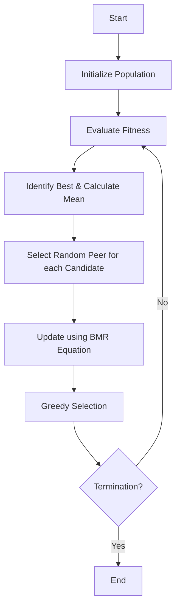

# BMR Algorithm (Best-Mean-Random)

## Overview

The Best-Mean-Random (BMR) algorithm is a simple, metaphor-free optimization technique proposed by Ravipudi Venkata Rao and Ravikumar Shah in 2024. It is designed to be computationally efficient and effective for both constrained and unconstrained optimization problems.

## Mechanism

The algorithm updates the position of each candidate solution based on three key influence points:
1.  **Best Solution ($X_{best}$):** The solution with the best fitness in the current population.
2.  **Mean Solution ($X_{mean}$):** The average position of all solutions in the population.
3.  **Random Solution ($X_{rand}$):** A randomly selected solution from the current population.

## Mathematical Formulation

For a candidate solution $X_i$ at iteration $t$, the new position $X'_{i}$ is calculated as:

$$X'_{i,j} = X_{i,j} + r_1  (X_{best,j} - T  X_{mean,j}) + r_2  (X_{best,j} - X_{rand,j})$$

Where:
- $X_{i,j}$ is the $j$-th variable of the $i$-th candidate.
- $r_1, r_2$ are random numbers between 0 and 1.
- $T$ is a factor that can be 1 or 2 (often randomly chosen or fixed).
- $X_{mean,j}$ is the mean of the $j$-th variable across the population.

*Note: Some variants might use a simpler form: $X' = X + r_1(X_{best} - X_{mean}) + r_2(X_{rand} - X)$. The implementation here follows the structure involving a Teaching-like factor $T$.*

## Algorithm Steps

### Workflow

1.  Initialize a population of random solutions within bounds.
2.  Evaluate the fitness of each solution.
3.  Identify the **Best** solution and calculate the **Mean** solution.
4.  For each solution $X_i$:
    *   Select a random solution $X_{rand}$ from the population ($i 
eq rand$).
    *   Generate random numbers $r_1, r_2$.
    *   Update $X_i$ using the update equation.
    *   Check bounds and clamp if necessary.
    *   Evaluate the new solution.
    *   If the new solution is better, replace the old one.
5.  Repeat steps 3-4 until termination criteria are met.

## References

- Ravipudi Venkata Rao and Ravikumar Shah, "BMR and BWR: Two simple metaphor-free optimization algorithms for solving real-life non-convex constrained and unconstrained problems", arXiv:2407.11149v2 (2024).
