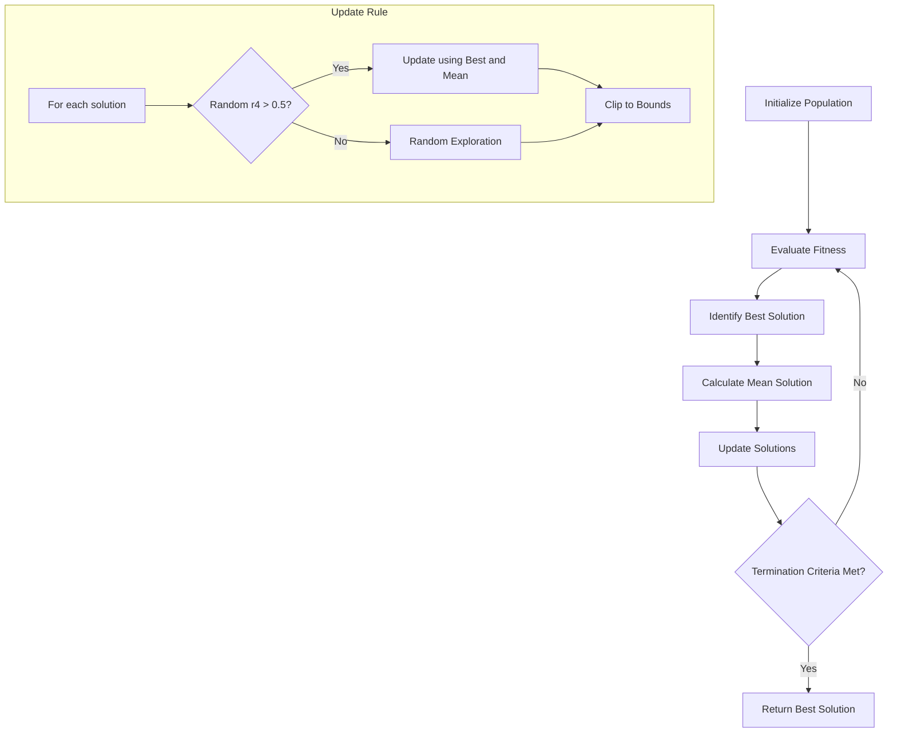
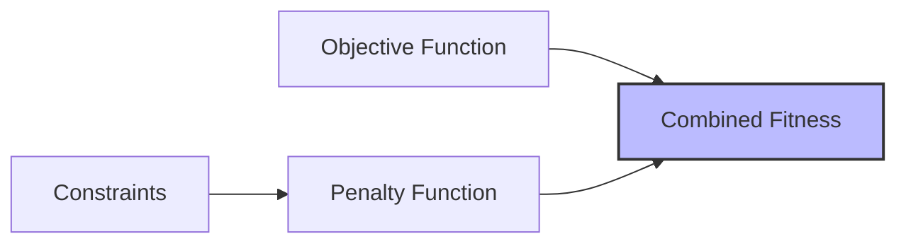

# BMR (Best-Mean-Random) Algorithm

## Overview

The BMR (Best-Mean-Random) algorithm is a simple, metaphor-free optimization algorithm designed to solve both constrained and unconstrained optimization problems. It uses the best solution, mean solution, and a random solution from the population to guide the search process.

## Algorithm Workflow



## Mathematical Formulation

The BMR algorithm updates solutions based on the following rules:

For each solution $X_i$ in the population:

1. Generate random numbers $r_1, r_2, r_3, r_4 \in [0,1]$
2. Randomly select $T \in \{1, 2\}$
3. Select a random solution $X_{rand}$ from the population
4. Update the solution:
   - If $r_4 > 0.5$:
     $X_i = X_i + r_1 \times (X_{best} - T \times X_{mean}) + r_2 \times (X_{best} - X_{rand})$
   - Otherwise:
     $X_i = X_{upper} - (X_{upper} - X_{lower}) \times r_3$
5. Clip the solution to ensure it stays within bounds

Where:
- $X_{best}$ is the best solution in the population
- $X_{mean}$ is the mean of all solutions in the population
- $X_{upper}$ and $X_{lower}$ are the upper and lower bounds

## Pseudocode

```
function BMR_algorithm(bounds, num_iterations, population_size, num_variables, objective_func, constraints):
    Initialize population randomly within bounds
    
    for iteration = 1 to num_iterations:
        Evaluate fitness of each solution (with penalty for constraints if applicable)
        Identify best solution and calculate mean solution
        
        for each solution in population:
            Generate random numbers r1, r2, r3, r4
            Randomly select T ∈ {1, 2}
            Select a random solution from the population
            
            if r4 > 0.5:
                Update solution using best and mean solutions
            else:
                Perform random exploration
                
            Clip solution to stay within bounds
    
    Return best solution and convergence history
```

## Implementation Details

The BMR algorithm is implemented in the `algorithms.py` file. Here's a breakdown of the key components:

1. **Initialization**: Population is initialized randomly within the specified bounds
2. **Fitness Evaluation**: Each solution is evaluated using the objective function (with penalty for constraints if applicable)
3. **Solution Update**: Solutions are updated based on the best solution, mean solution, and a random solution
4. **Exploration vs. Exploitation**: The algorithm balances exploration and exploitation through its update rules
5. **Constraint Handling**: Constraints are handled using a penalty function approach

## Parameters

| Parameter | Description |
|-----------|-------------|
| `bounds` | Lower and upper bounds for each variable |
| `num_iterations` | Maximum number of iterations |
| `population_size` | Number of solutions in the population |
| `num_variables` | Dimensionality of the problem |
| `objective_func` | Function to be optimized |
| `constraints` | List of constraint functions (optional) |

## Constrained Optimization

For constrained optimization problems, the BMR algorithm uses a penalty function approach:



The penalty function adds a penalty term to the objective function value based on the degree of constraint violation.

## Example Usage

```python
import numpy as np
from rao_algorithms import BMR_algorithm, objective_function

# Define the bounds for a 2D problem
bounds = np.array([[-100, 100]] * 2)

# Set parameters
num_iterations = 100
population_size = 50
num_variables = 2

# Run the BMR algorithm
best_solution, best_scores = BMR_algorithm(
    bounds, 
    num_iterations, 
    population_size, 
    num_variables, 
    objective_function
)
print(f"Best solution found: {best_solution}")
```

## Performance Characteristics

- **Convergence**: The BMR algorithm typically exhibits fast convergence due to its use of the mean solution
- **Exploration**: Random exploration is ensured through the random solution component and the random exploration step
- **Exploitation**: Exploitation is achieved through the use of the best solution and mean solution
- **Balance**: The algorithm maintains a good balance between exploration and exploitation

## References

1. Ravipudi Venkata Rao and Ravikumar Shah (2024), "BMR and BWR: Two simple metaphor-free optimization algorithms for solving real-life non-convex constrained and unconstrained problems." [arXiv:2407.11149v2](https://arxiv.org/abs/2407.11149).
