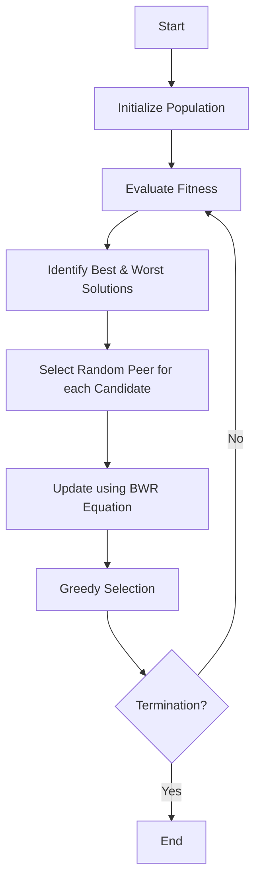

# BWR Algorithm (Best-Worst-Random)

## Overview

The Best-Worst-Random (BWR) algorithm is a metaphor-free optimization algorithm introduced alongside BMR by Ravipudi Venkata Rao and Ravikumar Shah in 2024. It focuses on exploiting the difference between the best and worst solutions while using a random solution for exploration.

## Mechanism

The update mechanism relies on:
1.  **Best Solution ($X_{best}$):** To pull the candidate towards the optimum.
2.  **Worst Solution ($X_{worst}$):** To push the candidate away from poor regions.
3.  **Random Solution ($X_{rand}$):** To maintain diversity.

## Mathematical Formulation

For a candidate solution $X_i$ at iteration $t$, the new position $X'_{i}$ is calculated as:

$$X'_{i,j} = X_{i,j} + r_1 \cdot (X_{best,j} - T \cdot X_{rand,j}) - r_2 \cdot (X_{worst,j} - X_{rand,j})$$

*Note: The signs and structure might vary slightly depending on the specific interpretation of "Best-Worst". The formulation above aligns with standard "move towards best, away from worst" logic enhanced by random interaction.*

Alternatively, a simpler form presented in some summaries is:
$$X'_{i,j} = X_{i,j} + r_1 \cdot (X_{best,j} - X_{worst,j}) + r_2 \cdot (X_{rand,j} - X_{i,j})$$

Our implementation typically follows the standard Rao-style logic of exploiting the best-worst differential.

## Algorithm Steps

### Workflow

1.  Initialize a population.
2.  Evaluate fitness.
3.  Identify $X_{best}$ and $X_{worst}$.
4.  For each solution $X_i$:
    *   Select random solution $X_{rand}$.
    *   Apply update equation.
    *   Greedy selection: Keep the new solution if it is better.
5.  Repeat until termination.

## References

- Ravipudi Venkata Rao and Ravikumar Shah, "BMR and BWR: Two simple metaphor-free optimization algorithms for solving real-life non-convex constrained and unconstrained problems", arXiv:2407.11149v2 (2024).
