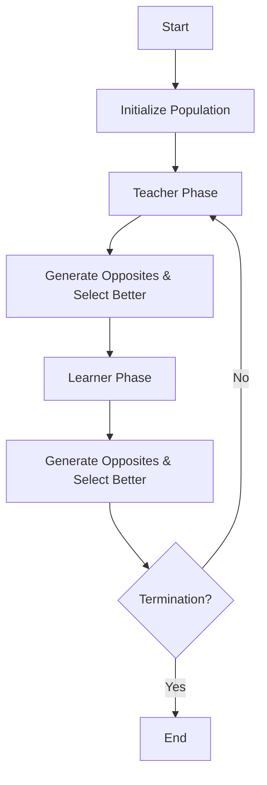

# Generalized Oppositional TLBO (GOTLBO)

## Overview

Generalized Oppositional TLBO (GOTLBO) incorporates **Opposition-Based Learning (OBL)** into the standard TLBO framework. This helps the algorithm escape local optima and accelerates convergence.

## Mechanism

In GOTLBO, after the standard updates in both the Teacher and Learner phases, an "Opposite" solution is generated.

### Opposition-Based Learning (OBL)
For a solution $X$, its opposite $X^{op}$ is defined as:
$$X^{op}_j = a_j + b_j - X_j$$
Where $[a_j, b_j]$ are the bounds for the $j$-th variable.

### Workflow Integration

1.  **Teacher Phase:** perform standard update $\rightarrow$ generate $X^{op}$ $\rightarrow$ select better of ($X$, $X^{op}$).
2.  **Learner Phase:** perform standard update $\rightarrow$ generate $X^{op}$ $\rightarrow$ select better of ($X$, $X^{op}$).

This "jump" to the opposite side of the search space provides diverse candidates and prevents stagnation.

## References
- R.V. Rao, V. Patel, "An improved teaching-learning-based optimization algorithm for solving unconstrained optimization problems", Scientia Iranica, 2013.
