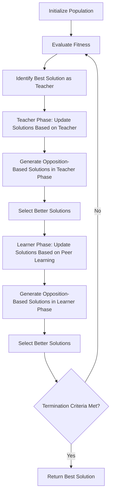

# Generalized Oppositional Teaching-Learning-Based Optimization (GOTLBO)

## Overview

The Generalized Oppositional Teaching-Learning-Based Optimization (GOTLBO) algorithm is an enhanced version of the standard TLBO algorithm developed by Prof. R.V. Rao. It incorporates oppositional-based learning to improve convergence speed and solution quality. The algorithm maintains the two-phase approach of the original TLBO (Teacher Phase and Learner Phase) while adding the ability to explore more of the search space through opposition.

## Key Features

- **Enhanced exploration**: Uses oppositional-based learning to explore more of the search space.
- **Parameter-free**: Like the original TLBO, GOTLBO doesn't require any algorithm-specific parameters.
- **Improved convergence**: Often converges faster than the standard TLBO algorithm.
- **Two-phase approach**: Maintains the Teacher Phase and Learner Phase from the original TLBO.
- **Handles constraints**: Effectively handles both constrained and unconstrained optimization problems.

## Algorithm Workflow



## Mathematical Formulation

### Teacher Phase with Opposition

For each student (solution) $X_i$ in the population at iteration $t$:

1. Generate a new solution using the standard TLBO teacher phase:

$$X_{i,new}^{t} = X_{i}^{t} + r \times (X_{teacher}^{t} - T_F \times M^{t})$$

Where:
- $X_{i}^{t}$ is the $i$-th student (solution) at iteration $t$
- $X_{teacher}^{t}$ is the best student (solution) at iteration $t$, acting as the teacher
- $M^{t}$ is the mean of all students (solutions) at iteration $t$
- $T_F$ is the teaching factor, which can be either 1 or 2 (randomly decided)
- $r$ is a random number in the range [0, 1]

2. Generate an opposite solution:

$$O_{i}^{t} = a + b - X_{i,new}^{t}$$

Where:
- $a$ and $b$ are the lower and upper bounds of the search space

3. Select the better of $X_{i,new}^{t}$ and $O_{i}^{t}$ based on their fitness values.

### Learner Phase with Opposition

For each student (solution) $X_i$ in the population:

1. Randomly select another student $X_j$ where $j \neq i$
2. Generate a new solution using the standard TLBO learner phase:

If $f(X_i) < f(X_j)$ (i.e., if $X_i$ is better than $X_j$):

$$X_{i,new}^{t} = X_{i}^{t} + r \times (X_{i}^{t} - X_{j}^{t})$$

If $f(X_i) \geq f(X_j)$ (i.e., if $X_i$ is worse than or equal to $X_j$):

$$X_{i,new}^{t} = X_{i}^{t} + r \times (X_{j}^{t} - X_{i}^{t})$$

Where $r$ is a random number in the range [0, 1].

3. Generate an opposite solution:

$$O_{i}^{t} = a + b - X_{i,new}^{t}$$

4. Select the better of $X_{i,new}^{t}$ and $O_{i}^{t}$ based on their fitness values.

## Example Usage

```python
import numpy as np
from rao_algorithms import GOTLBO_algorithm

# Define the objective function (to be minimized)
def sphere_function(x):
    return np.sum(x**2)

# Define problem parameters
bounds = np.array([[-10, 10]] * 10)  # 10D problem with bounds [-10, 10] for each dimension
num_iterations = 100
population_size = 50
num_variables = 10

# Run the GOTLBO algorithm
best_solution, convergence_curve = GOTLBO_algorithm(
    bounds, 
    num_iterations, 
    population_size, 
    num_variables, 
    sphere_function
)

print("Best solution found:", best_solution)
print("Best fitness value:", sphere_function(best_solution))
```

## Advantages

1. **Improved exploration**: Oppositional-based learning helps the algorithm explore more of the search space.
2. **Faster convergence**: Often converges faster than the standard TLBO algorithm.
3. **No algorithm-specific parameters**: Maintains the parameter-free nature of the original TLBO algorithm.
4. **Good for multimodal problems**: The enhanced exploration capability makes it effective for problems with multiple local optima.
5. **Effective for large-scale problems**: Like TLBO, GOTLBO performs well on high-dimensional optimization problems.

## Applications

GOTLBO has been successfully applied to various real-world problems, including:

- Mechanical design optimization
- Structural optimization
- Thermal system design
- Electrical power systems optimization
- Manufacturing process optimization
- Machine learning hyperparameter tuning

## Real-world Application: Mechanical Design Optimization

GOTLBO has been applied to mechanical design optimization problems, including the design of pressure vessels, spring design, and gear train design. It effectively finds optimal dimensions and parameters that minimize weight while satisfying safety constraints.

In a typical pressure vessel design problem:
- **Decision variables**: Thickness of the shell, thickness of the head, inner radius, length of the cylindrical section
- **Objective**: Minimize the total cost of the pressure vessel
- **Constraints**: Stress constraints, geometric constraints, minimum thickness requirements

GOTLBO efficiently navigates this complex parameter space to find optimal designs that minimize cost while meeting all safety requirements.

## References

- R. V. Rao, V. Patel, "An improved teaching-learning-based optimization algorithm for solving unconstrained optimization problems", Scientia Iranica, 20(3), 2013, 710-720.
- R. V. Rao, V. J. Savsani, D. P. Vakharia, "Teaching-Learning-Based Optimization: An optimization method for continuous non-linear large scale problems", Information Sciences, 183(1), 2012, 1-15.
