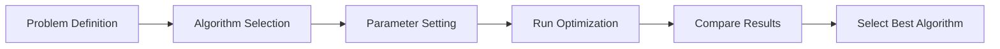

# Optimization Algorithms

This section provides detailed documentation for all the optimization algorithms implemented in this package.

## Available Algorithms

- [BMR (Best-Mean-Random) Algorithm](bmr.md): A simple yet effective algorithm that uses the best solution, mean solution, and a random solution to guide the search process.
- [BWR (Best-Worst-Random) Algorithm](bwr.md): An algorithm that uses the best solution, worst solution, and a random solution to guide the search process.
- [Jaya Algorithm](jaya.md): A parameter-free algorithm that always tries to move toward the best solution and away from the worst solution.
- [Rao Algorithms (Rao-1, Rao-2, Rao-3)](rao.md): Three metaphor-less algorithms that use different strategies to guide the search process.
- [TLBO (Teaching-Learning-Based Optimization)](tlbo.md): A parameter-free algorithm inspired by the teaching-learning process in a classroom.
- [QOJAYA (Quasi-Oppositional Jaya)](qojaya.md): An enhanced version of Jaya that incorporates quasi-oppositional learning for improved convergence.
- [GOTLBO (Generalized Oppositional TLBO)](gotlbo.md): An enhanced version of TLBO that incorporates oppositional-based learning to improve convergence.
- [ITLBO (Improved TLBO)](itlbo.md): An enhanced version of TLBO with adaptive teaching factors and elitism for better performance.
- [Multi-objective TLBO](multiobjective_tlbo.md): An extension of TLBO for solving problems with multiple competing objectives.

## Algorithm Comparison

The following table provides a comparison of the key features of the implemented algorithms:

| Algorithm | Parameter-Free | Based On | Key Feature |
|-----------|---------------|----------|-------------|
| BMR       | No            | Best, Mean, and Random solutions | Simple and effective for many problems |
| BWR       | No            | Best, Worst, and Random solutions | Good for avoiding local optima |
| Jaya      | Yes           | Best and Worst solutions | Simple concept with good convergence |
| Rao-1     | Yes           | Best solution and solution comparison | Metaphor-free with simple update rule |
| Rao-2     | Yes           | Best, Worst, and Average fitness | Uses fitness comparison with average |
| Rao-3     | Yes           | Best solution and phase factor | Decreasing influence of best solution over time |
| TLBO      | Yes           | Teacher-Student learning process | Two-phase approach with good performance on large-scale problems |
| QOJAYA    | Yes           | Jaya with quasi-oppositional learning | Enhanced exploration with improved convergence |
| GOTLBO    | Yes           | TLBO with oppositional-based learning | Better exploration and faster convergence |
| ITLBO     | Yes           | TLBO with adaptive teaching factors | Improved convergence with elite influence |
| MO-TLBO   | Yes           | TLBO with Pareto dominance | Handles multiple competing objectives |

## Convergence Comparison

The convergence speed and solution quality of these algorithms can vary depending on the specific problem. It is recommended to try multiple algorithms and compare their performance for your specific optimization task.

## When to Use Which Algorithm

- **BMR**: Good general-purpose algorithm, especially when the mean of the population provides useful information.
- **BWR**: Useful when you want to explicitly avoid the worst solutions in the search space.
- **Jaya**: Excellent choice when you want a parameter-free algorithm with good convergence properties.
- **Rao-1**: Good for problems where comparing solutions directly is beneficial.
- **Rao-2**: Useful when the average fitness of the population provides meaningful guidance.
- **Rao-3**: Effective when you want a decreasing influence of the best solution over time.
- **TLBO**: Excellent for large-scale problems and when you want a two-phase approach to optimization.
- **QOJAYA**: When you need better exploration capabilities than standard Jaya, especially for multimodal problems.
- **GOTLBO**: When you need faster convergence than standard TLBO for complex problems.
- **ITLBO**: When you need better solution quality than standard TLBO, especially for constrained problems.
- **MO-TLBO**: When you have multiple competing objectives and need a set of trade-off solutions.

For most single-objective problems, it is recommended to start with Jaya, TLBO, or their enhanced versions (QOJAYA, GOTLBO, ITLBO) due to their parameter-free nature and good general performance. For multi-objective problems, MO-TLBO is the recommended choice.
