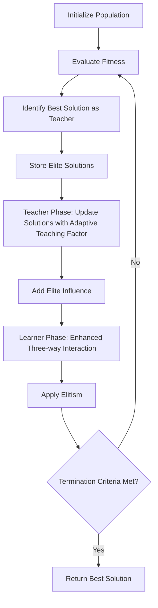

# Improved Teaching-Learning-Based Optimization (ITLBO)

## Overview

The Improved Teaching-Learning-Based Optimization (ITLBO) algorithm is an enhanced version of the standard TLBO algorithm developed by Prof. R.V. Rao. It incorporates an adaptive teaching factor, elite solution influence, and a modified learner phase to improve convergence speed and solution quality. The algorithm maintains the two-phase approach of the original TLBO while adding several improvements to enhance performance.

## Key Features

- **Adaptive teaching factor**: Unlike the original TLBO which uses a random teaching factor (1 or 2), ITLBO uses an adaptive teaching factor that changes based on the current iteration.
- **Elite solution influence**: Incorporates the influence of elite solutions to guide the search process.
- **Enhanced learner phase**: Uses a three-way interaction in the learner phase for better exploration.
- **Parameter-free**: Like the original TLBO, ITLBO doesn't require any algorithm-specific parameters that need tuning.
- **Handles constraints**: Effectively handles both constrained and unconstrained optimization problems.

## Algorithm Workflow



## Mathematical Formulation

### Adaptive Teaching Factor

In ITLBO, the teaching factor $T_F$ is calculated adaptively based on the current iteration:

$$T_F = 1 + \frac{current\_iteration}{max\_iterations}$$

This allows the teaching factor to gradually increase from 1 to 2 as the algorithm progresses, balancing exploration and exploitation.

### Teacher Phase with Elite Influence

For each student (solution) $X_i$ in the population at iteration $t$:

1. Generate a new solution using the adaptive teaching factor:

$$X_{i,new}^{t} = X_{i}^{t} + r_1 \times (X_{teacher}^{t} - T_F \times M^{t})$$

Where:
- $X_{i}^{t}$ is the $i$-th student (solution) at iteration $t$
- $X_{teacher}^{t}$ is the best student (solution) at iteration $t$, acting as the teacher
- $M^{t}$ is the mean of all students (solutions) at iteration $t$
- $T_F$ is the adaptive teaching factor
- $r_1$ is a random number in the range [0, 1]

2. Add elite influence:

$$X_{i,new}^{t} = X_{i,new}^{t} + r_2 \times (X_{elite}^{t} - X_{i}^{t})$$

Where:
- $X_{elite}^{t}$ is an elite solution (one of the top solutions) at iteration $t$
- $r_2$ is a random number in the range [0, 1]

### Enhanced Learner Phase

For each student (solution) $X_i$ in the population:

1. Randomly select two other students $X_j$ and $X_k$ where $j \neq i \neq k$
2. Generate a new solution using a three-way interaction:

$$X_{i,new}^{t} = X_{i}^{t} + r_3 \times (X_{j}^{t} - X_{k}^{t})$$

Where $r_3$ is a random number in the range [0, 1].

3. Apply elitism by ensuring that the new solution is at least as good as the original:

$$X_{i}^{t+1} = \begin{cases}
X_{i,new}^{t} & \text{if } f(X_{i,new}^{t}) < f(X_{i}^{t}) \\
X_{i}^{t} & \text{otherwise}
\end{cases}$$

## Example Usage

```python
import numpy as np
from rao_algorithms import ITLBO_algorithm

# Define the objective function (to be minimized)
def sphere_function(x):
    return np.sum(x**2)

# Define problem parameters
bounds = np.array([[-10, 10]] * 10)  # 10D problem with bounds [-10, 10] for each dimension
num_iterations = 100
population_size = 50
num_variables = 10

# Run the ITLBO algorithm
best_solution, convergence_curve = ITLBO_algorithm(
    bounds, 
    num_iterations, 
    population_size, 
    num_variables, 
    sphere_function
)

print("Best solution found:", best_solution)
print("Best fitness value:", sphere_function(best_solution))
```

## Advantages

1. **Improved convergence**: The adaptive teaching factor and elite influence lead to faster convergence.
2. **Better solution quality**: Often finds better solutions than the standard TLBO algorithm.
3. **Enhanced exploration**: The three-way interaction in the learner phase improves exploration of the search space.
4. **No algorithm-specific parameters**: Maintains the parameter-free nature of the original TLBO algorithm.
5. **Effective for complex problems**: Performs well on complex optimization problems with multiple local optima.

## Applications

ITLBO has been successfully applied to various real-world problems, including:

- Heat exchanger design optimization
- Power system optimization
- Structural design optimization
- Manufacturing process parameter optimization
- Mechanical component design
- Renewable energy systems optimization

## Real-world Application: Heat Exchanger Optimization

ITLBO has been successfully applied to optimize heat exchangers, finding the optimal design parameters that maximize heat transfer while minimizing pressure drop and material costs.

In a typical heat exchanger optimization problem:
- **Decision variables**: Tube diameter, tube length, baffle spacing, number of tubes, shell diameter
- **Objectives**: Maximize heat transfer rate, minimize pressure drop, minimize cost
- **Constraints**: Maximum pressure drop, minimum heat transfer rate, geometric constraints

ITLBO efficiently navigates this complex parameter space to find optimal designs that balance these competing objectives while satisfying all constraints.

## Real-world Application: Power System Optimization

ITLBO has also been used for power system optimization to minimize generation costs and transmission losses while satisfying load demands and system constraints.

In a typical power system optimization problem:
- **Decision variables**: Power output of each generator, transformer tap settings, capacitor bank settings
- **Objective**: Minimize total generation cost and transmission losses
- **Constraints**: Power balance, generator limits, line flow limits, voltage limits

ITLBO effectively solves these complex problems, finding optimal power system configurations that minimize costs while ensuring reliable operation.

## References

- R. V. Rao, V. Patel, "An elitist teaching-learning-based optimization algorithm for solving complex constrained optimization problems", International Journal of Industrial Engineering Computations, 3(4), 2012, 535-560.
- R. V. Rao, V. J. Savsani, D. P. Vakharia, "Teaching-Learning-Based Optimization: An optimization method for continuous non-linear large scale problems", Information Sciences, 183(1), 2012, 1-15.
