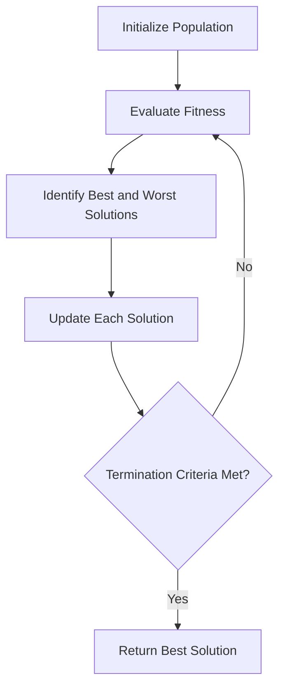

# Jaya Algorithm

## Overview

The Jaya algorithm is a simple yet powerful optimization algorithm developed by Prof. R.V. Rao in 2016. The name "Jaya" means "victory" in Sanskrit, representing the algorithm's tendency to move toward success (best solution) and away from failure (worst solution).

## Key Features

- **Parameter-free**: Unlike many other optimization algorithms, Jaya doesn't require any algorithm-specific parameters that need tuning.
- **Simple concept**: The algorithm is based on the simple concept that a solution should move toward the best solution and away from the worst solution.
- **Effective for constrained and unconstrained problems**: Jaya has been shown to be effective for both constrained and unconstrained optimization problems.
- **Versatile**: Applicable to a wide range of optimization problems in various domains.

## Algorithm Workflow



## Mathematical Formulation

For each candidate solution $X_i$ in the population at iteration $t$, the algorithm updates the solution as follows:

$$X_{i,j}^{t+1} = X_{i,j}^{t} + r_{1,j}^{t} \times (X_{best,j}^{t} - |X_{i,j}^{t}|) - r_{2,j}^{t} \times (X_{worst,j}^{t} - |X_{i,j}^{t}|)$$

Where:
- $X_{i,j}^{t}$ is the value of the $j$-th variable of the $i$-th candidate at iteration $t$
- $X_{best,j}^{t}$ is the value of the $j$-th variable of the best candidate at iteration $t$
- $X_{worst,j}^{t}$ is the value of the $j$-th variable of the worst candidate at iteration $t$
- $r_{1,j}^{t}$ and $r_{2,j}^{t}$ are random numbers in the range [0, 1]

## Example Usage

```python
import numpy as np
from rao_algorithms import Jaya_algorithm

# Define the objective function (to be minimized)
def sphere_function(x):
    return np.sum(x**2)

# Define problem parameters
bounds = np.array([[-10, 10]] * 5)  # 5D problem with bounds [-10, 10] for each dimension
num_iterations = 100
population_size = 50
num_variables = 5

# Run the Jaya algorithm
best_solution, convergence_curve = Jaya_algorithm(
    bounds, 
    num_iterations, 
    population_size, 
    num_variables, 
    sphere_function
)

print("Best solution found:", best_solution)
print("Best fitness value:", sphere_function(best_solution))
```

## Advantages

1. **Simplicity**: The algorithm is easy to understand and implement.
2. **No algorithm-specific parameters**: No need to tune algorithm-specific parameters.
3. **Efficiency**: Jaya often converges quickly to good solutions.
4. **Versatility**: Applicable to a wide range of optimization problems.

## Applications

The Jaya algorithm has been successfully applied to various real-world problems, including:

- Engineering design optimization
- Manufacturing process optimization
- Renewable energy systems optimization
- Economic dispatch problems
- Machine learning hyperparameter tuning

## References

- R.V. Rao, "Jaya: A simple and new optimization algorithm for solving constrained and unconstrained optimization problems", International Journal of Industrial Engineering Computations, 7(1), 2016, 19-34.
