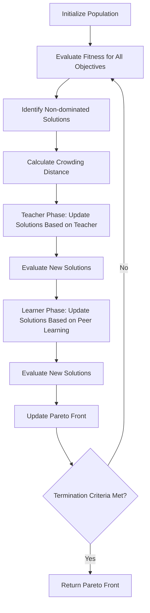

# Multi-objective Teaching-Learning-Based Optimization (MO-TLBO)

## Overview

The Multi-objective Teaching-Learning-Based Optimization (MO-TLBO) algorithm extends the standard TLBO algorithm to handle problems with multiple competing objectives. Developed by Prof. R.V. Rao, it uses Pareto dominance and crowding distance for selection, maintaining the two-phase approach of the original TLBO (Teacher Phase and Learner Phase) while adapting it for multi-objective optimization.

## Key Features

- **Multi-objective optimization**: Handles problems with multiple competing objectives.
- **Pareto dominance**: Uses Pareto dominance to identify non-dominated solutions.
- **Crowding distance**: Maintains diversity in the Pareto front using crowding distance.
- **Parameter-free**: Like the original TLBO, MO-TLBO doesn't require any algorithm-specific parameters.
- **Two-phase approach**: Maintains the Teacher Phase and Learner Phase from the original TLBO.
- **Handles constraints**: Effectively handles both constrained and unconstrained optimization problems.

## Algorithm Workflow



## Mathematical Formulation

### Pareto Dominance

A solution $X_1$ is said to dominate another solution $X_2$ (denoted as $X_1 \prec X_2$) if:

1. $X_1$ is no worse than $X_2$ in all objectives, and
2. $X_1$ is strictly better than $X_2$ in at least one objective.

Mathematically, for a minimization problem with $m$ objectives:

$X_1 \prec X_2$ if and only if:
- $f_i(X_1) \leq f_i(X_2)$ for all $i \in \{1, 2, ..., m\}$, and
- $f_j(X_1) < f_j(X_2)$ for at least one $j \in \{1, 2, ..., m\}$

### Crowding Distance

The crowding distance is a measure of how close a solution is to its neighbors in the objective space. It is calculated as follows:

1. For each objective function $f_i$:
   - Sort the solutions in ascending order of $f_i$
   - Assign infinite crowding distance to the boundary solutions (minimum and maximum values of $f_i$)
   - For all other solutions, calculate the crowding distance as:
   
   $$d_i(j) = d_i(j) + \frac{f_i(j+1) - f_i(j-1)}{f_i^{max} - f_i^{min}}$$
   
   Where $d_i(j)$ is the crowding distance of the $j$-th solution for the $i$-th objective, and $f_i^{max}$ and $f_i^{min}$ are the maximum and minimum values of the $i$-th objective function.

2. The total crowding distance of a solution is the sum of its crowding distances for all objectives.

### Teacher Phase

For each student (solution) $X_i$ in the population at iteration $t$:

$$X_{i,new}^{t} = X_{i}^{t} + r \times (X_{teacher}^{t} - T_F \times M^{t})$$

Where:
- $X_{i}^{t}$ is the $i$-th student (solution) at iteration $t$
- $X_{teacher}^{t}$ is one of the non-dominated solutions (Pareto front) at iteration $t$, selected based on crowding distance
- $M^{t}$ is the mean of all students (solutions) at iteration $t$
- $T_F$ is the teaching factor, which can be either 1 or 2 (randomly decided)
- $r$ is a random number in the range [0, 1]

### Learner Phase

For each student (solution) $X_i$ in the population:

1. Randomly select another student $X_j$ where $j \neq i$
2. Compare the dominance of $X_i$ and $X_j$:

If $X_i \prec X_j$ (i.e., if $X_i$ dominates $X_j$):

$$X_{i,new}^{t} = X_{i}^{t} + r \times (X_{i}^{t} - X_{j}^{t})$$

If $X_j \prec X_i$ (i.e., if $X_j$ dominates $X_i$):

$$X_{i,new}^{t} = X_{i}^{t} + r \times (X_{j}^{t} - X_{i}^{t})$$

If neither dominates the other, select one randomly.

Where $r$ is a random number in the range [0, 1].

### Pareto Front Update

After each iteration, the non-dominated solutions from the combined population (old and new solutions) are identified to form the Pareto front. If the number of non-dominated solutions exceeds the population size, selection is performed based on crowding distance to maintain diversity.

## Example Usage

```python
import numpy as np
from rao_algorithms import MultiObjective_TLBO_algorithm

# Define two objective functions
def objective_function1(x):
    return np.sum(x**2)  # Minimize the sum of squares

def objective_function2(x):
    return np.sum((x-2)**2)  # Minimize the sum of squares from point (2,2,...)

# Define problem parameters
bounds = np.array([[-10, 10]] * 5)  # 5D problem with bounds [-10, 10] for each dimension
num_iterations = 100
population_size = 50
num_variables = 5

# Run the Multi-objective TLBO algorithm
pareto_front, pareto_fitness, convergence_history = MultiObjective_TLBO_algorithm(
    bounds, 
    num_iterations, 
    population_size, 
    num_variables, 
    [objective_function1, objective_function2]
)

print("Number of solutions in Pareto front:", len(pareto_front))
print("First Pareto optimal solution:", pareto_front[0])
print("Corresponding objective values:", pareto_fitness[0])
```

## Advantages

1. **Handles multiple objectives**: Can solve problems with multiple competing objectives.
2. **Provides a set of trade-off solutions**: Returns a Pareto front of non-dominated solutions rather than a single solution.
3. **Maintains diversity**: Uses crowding distance to ensure diversity in the Pareto front.
4. **No algorithm-specific parameters**: Maintains the parameter-free nature of the original TLBO algorithm.
5. **Effective for complex problems**: Performs well on complex multi-objective optimization problems.

## Applications

MO-TLBO has been successfully applied to various real-world problems, including:

- Manufacturing process optimization
- Structural design optimization
- Supply chain optimization
- Renewable energy systems design
- Water resource management
- Portfolio optimization

## Real-world Application: Machining Process Optimization

The Multi-objective TLBO algorithm has been applied to optimize machining processes like turning, milling, and grinding operations. It simultaneously optimizes multiple objectives such as surface roughness, material removal rate, and tool wear, helping manufacturers achieve high-quality parts with efficient production.

In a typical machining process optimization problem:
- **Decision variables**: Cutting speed, feed rate, depth of cut, tool geometry
- **Objectives**: Minimize surface roughness, maximize material removal rate, minimize tool wear
- **Constraints**: Maximum cutting force, maximum temperature, machine power limits

MO-TLBO efficiently navigates this complex parameter space to find a set of Pareto optimal solutions that represent different trade-offs between the competing objectives. This allows manufacturers to choose the solution that best fits their specific requirements.

## References

- R. V. Rao, V. D. Kalyankar, "Multi-objective TLBO algorithm for optimization of modern machining processes", Advances in Intelligent Systems and Computing, 236, 2014, 21-31.
- R. V. Rao, V. J. Savsani, D. P. Vakharia, "Teaching-Learning-Based Optimization: An optimization method for continuous non-linear large scale problems", Information Sciences, 183(1), 2012, 1-15.
