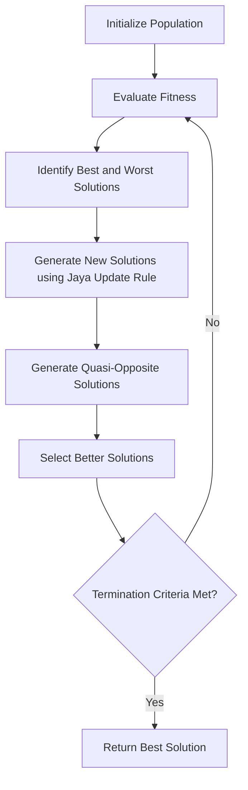

# Quasi-Oppositional Jaya (QOJAYA) Algorithm

## Overview

The Quasi-Oppositional Jaya (QOJAYA) algorithm is an enhanced version of the standard Jaya algorithm developed by Prof. R.V. Rao. It incorporates quasi-oppositional learning to improve convergence speed and solution quality. The algorithm maintains the parameter-free nature of the original Jaya algorithm while adding the ability to explore more of the search space through quasi-opposition.

## Key Features

- **Enhanced exploration**: Uses quasi-oppositional learning to explore more of the search space.
- **Parameter-free**: Like the original Jaya, QOJAYA doesn't require any algorithm-specific parameters.
- **Improved convergence**: Often converges faster than the standard Jaya algorithm.
- **Handles constraints**: Effectively handles both constrained and unconstrained optimization problems.

## Algorithm Workflow



## Mathematical Formulation

### Jaya Update Rule

For each candidate solution $X_i$ in the population at iteration $t$:

$$X_{i,new}^{t} = X_{i}^{t} + r_1 \times (X_{best}^{t} - |X_{i}^{t}|) - r_2 \times (X_{worst}^{t} - |X_{i}^{t}|)$$

Where:
- $X_{i}^{t}$ is the $i$-th solution at iteration $t$
- $X_{best}^{t}$ is the best solution at iteration $t$
- $X_{worst}^{t}$ is the worst solution at iteration $t$
- $r_1$ and $r_2$ are random numbers in the range [0, 1]

### Quasi-Oppositional Learning

For each new solution $X_{i,new}^{t}$, generate a quasi-opposite solution $QO_{i}^{t}$:

$$QO_{i}^{t} = rand(a + b - X_{i,new}^{t}, \frac{a + b}{2})$$

Where:
- $a$ and $b$ are the lower and upper bounds of the search space
- $rand(p, q)$ returns a random number between $p$ and $q$
- $\frac{a + b}{2}$ represents the center of the search space

The algorithm then selects the better of $X_{i,new}^{t}$ and $QO_{i}^{t}$ based on their fitness values.

## Example Usage

```python
import numpy as np
from rao_algorithms import QOJAYA_algorithm

# Define the objective function (to be minimized)
def sphere_function(x):
    return np.sum(x**2)

# Define problem parameters
bounds = np.array([[-10, 10]] * 10)  # 10D problem with bounds [-10, 10] for each dimension
num_iterations = 100
population_size = 50
num_variables = 10

# Run the QOJAYA algorithm
best_solution, convergence_curve = QOJAYA_algorithm(
    bounds, 
    num_iterations, 
    population_size, 
    num_variables, 
    sphere_function
)

print("Best solution found:", best_solution)
print("Best fitness value:", sphere_function(best_solution))
```

## Advantages

1. **Improved exploration**: Quasi-oppositional learning helps the algorithm explore more of the search space.
2. **Faster convergence**: Often converges faster than the standard Jaya algorithm.
3. **No algorithm-specific parameters**: Maintains the parameter-free nature of the original Jaya algorithm.
4. **Good for multimodal problems**: The enhanced exploration capability makes it effective for problems with multiple local optima.

## Applications

QOJAYA has been successfully applied to various real-world problems, including:

- Welding process optimization (TIG welding, friction stir welding)
- Manufacturing process parameter optimization
- Structural design optimization
- Mechanical component design
- Electrical power systems optimization

## Real-world Application: Welding Process Optimization

QOJAYA has been successfully applied to optimize welding processes, including tungsten inert gas (TIG) welding and friction stir welding. It determines optimal parameters like welding current, voltage, and speed to maximize weld strength while minimizing defects.

In a typical welding optimization problem:
- **Decision variables**: Welding current, voltage, travel speed, electrode diameter, etc.
- **Objectives**: Maximize weld strength, minimize distortion, minimize defects
- **Constraints**: Maximum temperature, material limitations, equipment capabilities

QOJAYA efficiently navigates this complex parameter space to find optimal welding parameters that produce high-quality welds.

## References

- R. V. Rao, D. P. Rai, "Optimization of welding processes using quasi-oppositional-based Jaya algorithm", Journal of Mechanical Science and Technology, 31(5), 2017, 2513-2522.
- R. V. Rao, "Jaya: A simple and new optimization algorithm for solving constrained and unconstrained optimization problems", International Journal of Industrial Engineering Computations, 7(1), 2016, 19-34.
