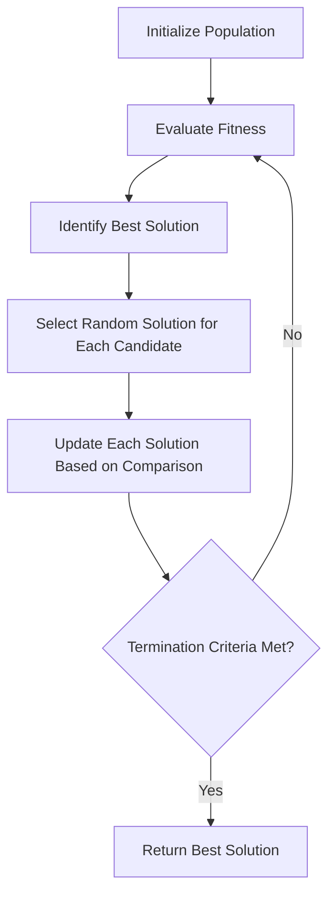
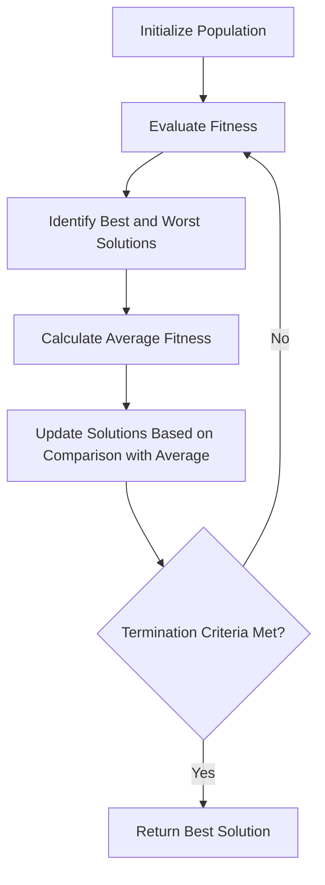
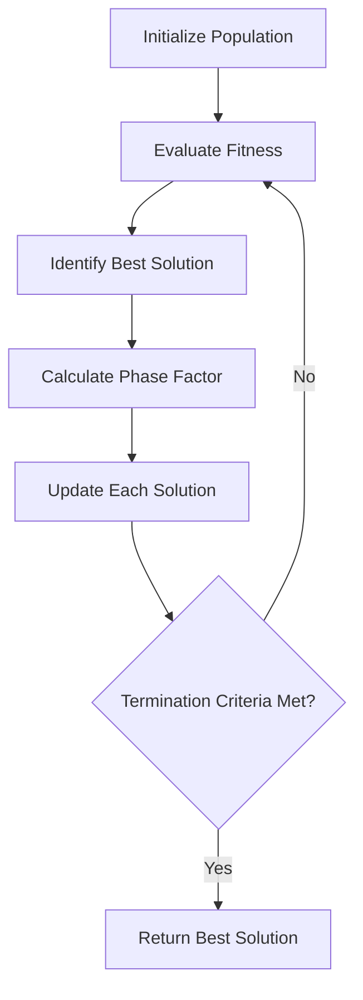

# Rao Algorithms

## Overview

The Rao algorithms are a family of three metaphor-less optimization algorithms developed by Prof. R.V. Rao in 2020. These algorithms (Rao-1, Rao-2, and Rao-3) are designed to be simple, effective, and free from any metaphorical inspiration, focusing purely on mathematical principles for optimization.

## Key Features

- **Metaphor-free**: Unlike many nature-inspired algorithms, Rao algorithms don't rely on metaphors from natural or physical processes.
- **Simple formulation**: All three algorithms have straightforward mathematical formulations.
- **Effective performance**: Despite their simplicity, these algorithms demonstrate competitive performance on various optimization problems.
- **No algorithm-specific parameters**: The algorithms don't require tuning of special parameters.

## Rao-1 Algorithm

### Workflow



### Mathematical Formulation

For each candidate solution $X_i$ in the population at iteration $t$, Rao-1 updates the solution as follows:

If $f(X_i) > f(X_j)$ (i.e., if $X_i$ is worse than randomly selected $X_j$):

$$X_{i}^{t+1} = X_{i}^{t} + r \times (X_{best}^{t} - |X_{i}^{t}|) + r \times (X_{j}^{t} - |X_{i}^{t}|)$$

If $f(X_i) \leq f(X_j)$ (i.e., if $X_i$ is better than or equal to randomly selected $X_j$):

$$X_{i}^{t+1} = X_{i}^{t} + r \times (X_{best}^{t} - |X_{i}^{t}|) - r \times (X_{j}^{t} - |X_{i}^{t}|)$$

Where:
- $X_{i}^{t}$ is the $i$-th candidate solution at iteration $t$
- $X_{best}^{t}$ is the best solution at iteration $t$
- $X_{j}^{t}$ is a randomly selected solution (where $j \neq i$)
- $r$ is a random number in the range [0, 1]
- $f()$ is the objective function to be minimized

## Rao-2 Algorithm

### Workflow



### Mathematical Formulation

For each candidate solution $X_i$ in the population at iteration $t$, Rao-2 updates the solution as follows:

If $f(X_i) \leq f_{avg}$ (i.e., if $X_i$ is better than the average solution):

$$X_{i}^{t+1} = X_{i}^{t} + r_1 \times (X_{best}^{t} - X_{worst}^{t})$$

If $f(X_i) > f_{avg}$ (i.e., if $X_i$ is worse than the average solution):

$$X_{i}^{t+1} = X_{i}^{t} + r_2 \times (X_{best}^{t} - X_{worst}^{t})$$

Where:
- $X_{i}^{t}$ is the $i$-th candidate solution at iteration $t$
- $X_{best}^{t}$ is the best solution at iteration $t$
- $X_{worst}^{t}$ is the worst solution at iteration $t$
- $f_{avg}$ is the average fitness value of all solutions
- $r_1$ and $r_2$ are random numbers in the range [0, 1]

## Rao-3 Algorithm

### Workflow



### Mathematical Formulation

For each candidate solution $X_i$ in the population at iteration $t$, Rao-3 updates the solution as follows:

$$X_{i}^{t+1} = X_{i}^{t} + r \times phase \times (X_{best}^{t} - X_{i}^{t})$$

Where:
- $X_{i}^{t}$ is the $i$-th candidate solution at iteration $t$
- $X_{best}^{t}$ is the best solution at iteration $t$
- $r$ is a random number in the range [0, 1]
- $phase = 1 - \frac{t}{t_{max}}$ is a factor that decreases with iterations

## Example Usage

```python
import numpy as np
from rao_algorithms import Rao1_algorithm, Rao2_algorithm, Rao3_algorithm

# Define the objective function (to be minimized)
def sphere_function(x):
    return np.sum(x**2)

# Define problem parameters
bounds = np.array([[-10, 10]] * 5)  # 5D problem with bounds [-10, 10] for each dimension
num_iterations = 100
population_size = 50
num_variables = 5

# Run the Rao-1 algorithm
best_solution_rao1, convergence_curve_rao1 = Rao1_algorithm(
    bounds, 
    num_iterations, 
    population_size, 
    num_variables, 
    sphere_function
)

# Run the Rao-2 algorithm
best_solution_rao2, convergence_curve_rao2 = Rao2_algorithm(
    bounds, 
    num_iterations, 
    population_size, 
    num_variables, 
    sphere_function
)

# Run the Rao-3 algorithm
best_solution_rao3, convergence_curve_rao3 = Rao3_algorithm(
    bounds, 
    num_iterations, 
    population_size, 
    num_variables, 
    sphere_function
)

print("Rao-1 best solution:", best_solution_rao1)
print("Rao-1 best fitness:", sphere_function(best_solution_rao1))

print("Rao-2 best solution:", best_solution_rao2)
print("Rao-2 best fitness:", sphere_function(best_solution_rao2))

print("Rao-3 best solution:", best_solution_rao3)
print("Rao-3 best fitness:", sphere_function(best_solution_rao3))
```

## Advantages

1. **Simplicity**: The algorithms are easy to understand and implement.
2. **No metaphorical inspiration**: Focuses purely on mathematical principles.
3. **No algorithm-specific parameters**: No need for parameter tuning.
4. **Versatility**: Applicable to a wide range of optimization problems.

## Applications

The Rao algorithms have been successfully applied to various real-world problems, including:

- Engineering design optimization
- Manufacturing process optimization
- Machine learning model optimization
- Structural optimization
- Energy systems optimization

## References

- R.V. Rao, "Rao algorithms: Three metaphor-less simple algorithms for solving optimization problems", International Journal of Industrial Engineering Computations, 11(2), 2020, 193-212.
