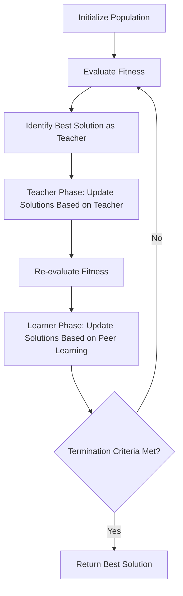

# Teaching-Learning-Based Optimization (TLBO)

## Overview

The Teaching-Learning-Based Optimization (TLBO) algorithm is a parameter-free optimization algorithm developed by Prof. R.V. Rao in 2011. It is inspired by the teaching-learning process in a classroom, where students (solutions) learn from a teacher (the best solution) and from interactions with other students.

## Key Features

- **Parameter-free**: TLBO doesn't require any algorithm-specific parameters that need tuning.
- **Two-phase approach**: Consists of the Teacher Phase and the Learner Phase.
- **Effective for large-scale problems**: TLBO has shown good performance on high-dimensional optimization problems.
- **Handles constraints efficiently**: Well-suited for constrained optimization problems.

## Algorithm Workflow



## Mathematical Formulation

### Teacher Phase

For each student (solution) $X_i$ in the population at iteration $t$:

$$X_{i,new}^{t} = X_{i}^{t} + r \times (X_{teacher}^{t} - T_F \times M^{t})$$

Where:
- $X_{i}^{t}$ is the $i$-th student (solution) at iteration $t$
- $X_{teacher}^{t}$ is the best student (solution) at iteration $t$, acting as the teacher
- $M^{t}$ is the mean of all students (solutions) at iteration $t$
- $T_F$ is the teaching factor, which can be either 1 or 2 (randomly decided)
- $r$ is a random number in the range [0, 1]

The new solution $X_{i,new}^{t}$ is accepted if it is better than $X_{i}^{t}$.

### Learner Phase

For each student (solution) $X_i$ in the population:

1. Randomly select another student $X_j$ where $j \neq i$
2. Compare the fitness of $X_i$ and $X_j$
3. Update $X_i$ as follows:

If $f(X_i) < f(X_j)$ (i.e., if $X_i$ is better than $X_j$):

$$X_{i,new}^{t} = X_{i}^{t} + r \times (X_{i}^{t} - X_{j}^{t})$$

If $f(X_i) \geq f(X_j)$ (i.e., if $X_i$ is worse than or equal to $X_j$):

$$X_{i,new}^{t} = X_{i}^{t} + r \times (X_{j}^{t} - X_{i}^{t})$$

Where $r$ is a random number in the range [0, 1].

The new solution $X_{i,new}^{t}$ is accepted if it is better than $X_{i}^{t}$.

## Example Usage

```python
import numpy as np
from rao_algorithms import TLBO_algorithm

# Define the objective function (to be minimized)
def sphere_function(x):
    return np.sum(x**2)

# Define problem parameters
bounds = np.array([[-10, 10]] * 10)  # 10D problem with bounds [-10, 10] for each dimension
num_iterations = 100
population_size = 50
num_variables = 10

# Run the TLBO algorithm
best_solution, convergence_curve = TLBO_algorithm(
    bounds, 
    num_iterations, 
    population_size, 
    num_variables, 
    sphere_function
)

print("Best solution found:", best_solution)
print("Best fitness value:", sphere_function(best_solution))
```

## Advantages

1. **No algorithm-specific parameters**: No need for parameter tuning, making it easier to use.
2. **Effective for large-scale problems**: TLBO has shown good performance on high-dimensional optimization problems.
3. **Handles constraints efficiently**: Well-suited for constrained optimization problems.
4. **Good convergence rate**: Often converges quickly to good solutions.

## Applications

TLBO has been successfully applied to various real-world problems, including:

- Mechanical design optimization
- Structural optimization
- Thermal system design
- Electrical power systems optimization
- Manufacturing process optimization
- Machine learning hyperparameter tuning

## Variants

Several variants of TLBO have been proposed, including:

- Elitist TLBO
- Modified TLBO
- Quantum-behaved TLBO
- Self-adaptive TLBO
- Multi-objective TLBO

## References

- R.V. Rao, V.J. Savsani, D.P. Vakharia, "Teaching-Learning-Based Optimization: An optimization method for continuous non-linear large scale problems", Information Sciences, 183(1), 2012, 1-15.
- R.V. Rao, "Teaching Learning Based Optimization Algorithm: And Its Engineering Applications", Springer, 2015.
