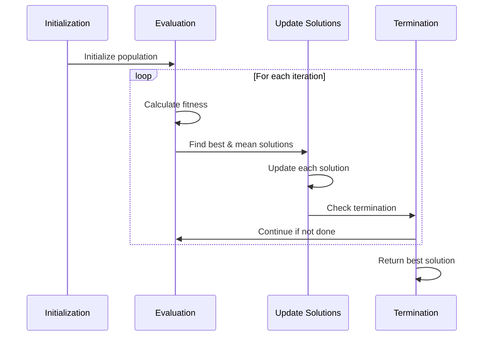
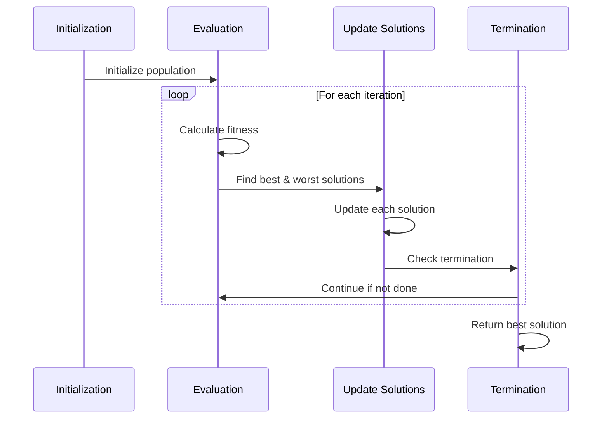
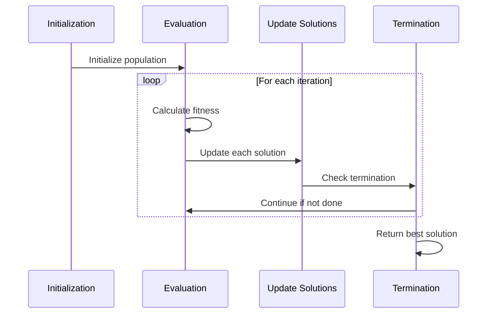

# Algorithms Module

The `algorithms.py` module contains the core optimization algorithms implemented in this package.

## BMR Algorithm

```python
BMR_algorithm(bounds, num_iterations, population_size, num_variables, objective_func, constraints=None)
```

Implements the Best-Mean-Random (BMR) optimization algorithm.

### Parameters

| Parameter | Type | Description |
|-----------|------|-------------|
| `bounds` | numpy.ndarray | Lower and upper bounds for each variable, shape (num_variables, 2) |
| `num_iterations` | int | Maximum number of iterations |
| `population_size` | int | Number of solutions in the population |
| `num_variables` | int | Dimensionality of the problem |
| `objective_func` | callable | Function to be optimized |
| `constraints` | list, optional | List of constraint functions (default: None) |

### Returns

| Return Value | Type | Description |
|--------------|------|-------------|
| `best_solution` | numpy.ndarray | Best solution found |
| `best_scores` | list | List of best scores in each iteration |

### Algorithm Flow



### Example

```python
import numpy as np
from rao_algorithms import BMR_algorithm, objective_function

bounds = np.array([[-100, 100]] * 2)
num_iterations = 100
population_size = 50
num_variables = 2

best_solution, best_scores = BMR_algorithm(
    bounds, 
    num_iterations, 
    population_size, 
    num_variables, 
    objective_function
)
```

## BWR Algorithm

```python
BWR_algorithm(bounds, num_iterations, population_size, num_variables, objective_func, constraints=None)
```

Implements the Best-Worst-Random (BWR) optimization algorithm.

### Parameters

| Parameter | Type | Description |
|-----------|------|-------------|
| `bounds` | numpy.ndarray | Lower and upper bounds for each variable, shape (num_variables, 2) |
| `num_iterations` | int | Maximum number of iterations |
| `population_size` | int | Number of solutions in the population |
| `num_variables` | int | Dimensionality of the problem |
| `objective_func` | callable | Function to be optimized |
| `constraints` | list, optional | List of constraint functions (default: None) |

### Returns

| Return Value | Type | Description |
|--------------|------|-------------|
| `best_solution` | numpy.ndarray | Best solution found |
| `best_scores` | list | List of best scores in each iteration |

### Algorithm Flow



### Example

```python
import numpy as np
from rao_algorithms import BWR_algorithm, objective_function

bounds = np.array([[-100, 100]] * 2)
num_iterations = 100
population_size = 50
num_variables = 2

best_solution, best_scores = BWR_algorithm(
    bounds, 
    num_iterations, 
    population_size, 
    num_variables, 
    objective_function
)
```

## Jaya Algorithm

```python
Jaya_algorithm(bounds, num_iterations, population_size, num_variables, objective_func, constraints=None)
```

Implements the Jaya optimization algorithm.

### Parameters

| Parameter | Type | Description |
|-----------|------|-------------|
| `bounds` | numpy.ndarray | Lower and upper bounds for each variable, shape (num_variables, 2) |
| `num_iterations` | int | Maximum number of iterations |
| `population_size` | int | Number of solutions in the population |
| `num_variables` | int | Dimensionality of the problem |
| `objective_func` | callable | Function to be optimized |
| `constraints` | list, optional | List of constraint functions (default: None) |

### Returns

| Return Value | Type | Description |
|--------------|------|-------------|
| `best_solution` | numpy.ndarray | Best solution found |
| `best_scores` | list | List of best scores in each iteration |

### Algorithm Flow



### Example

```python
import numpy as np
from rao_algorithms import Jaya_algorithm, objective_function

bounds = np.array([[-100, 100]] * 2)
num_iterations = 100
population_size = 50
num_variables = 2

best_solution, best_scores = Jaya_algorithm(
    bounds, 
    num_iterations, 
    population_size, 
    num_variables, 
    objective_function
)
```

## Rao-1 Algorithm

```python
Rao1_algorithm(bounds, num_iterations, population_size, num_variables, objective_func, constraints=None)
```

Implements the Rao-1 optimization algorithm.

### Parameters

| Parameter | Type | Description |
|-----------|------|-------------|
| `bounds` | numpy.ndarray | Lower and upper bounds for each variable, shape (num_variables, 2) |
| `num_iterations` | int | Maximum number of iterations |
| `population_size` | int | Number of solutions in the population |
| `num_variables` | int | Dimensionality of the problem |
| `objective_func` | callable | Function to be optimized |
| `constraints` | list, optional | List of constraint functions (default: None) |

### Returns

| Return Value | Type | Description |
|--------------|------|-------------|
| `best_solution` | numpy.ndarray | Best solution found |
| `best_scores` | list | List of best scores in each iteration |

### Algorithm Flow


### Example

```python
import numpy as np
from rao_algorithms import Rao1_algorithm, objective_function

bounds = np.array([[-100, 100]] * 2)
num_iterations = 100
population_size = 50
num_variables = 2

best_solution, best_scores = Rao1_algorithm(
    bounds, 
    num_iterations, 
    population_size, 
    num_variables, 
    objective_function
)
```

## Rao-2 Algorithm

```python
Rao2_algorithm(bounds, num_iterations, population_size, num_variables, objective_func, constraints=None)
```

Implements the Rao-2 optimization algorithm.

### Parameters

| Parameter | Type | Description |
|-----------|------|-------------|
| `bounds` | numpy.ndarray | Lower and upper bounds for each variable, shape (num_variables, 2) |
| `num_iterations` | int | Maximum number of iterations |
| `population_size` | int | Number of solutions in the population |
| `num_variables` | int | Dimensionality of the problem |
| `objective_func` | callable | Function to be optimized |
| `constraints` | list, optional | List of constraint functions (default: None) |

### Returns

| Return Value | Type | Description |
|--------------|------|-------------|
| `best_solution` | numpy.ndarray | Best solution found |
| `best_scores` | list | List of best scores in each iteration |

### Algorithm Flow


### Example

```python
import numpy as np
from rao_algorithms import Rao2_algorithm, objective_function

bounds = np.array([[-100, 100]] * 2)
num_iterations = 100
population_size = 50
num_variables = 2

best_solution, best_scores = Rao2_algorithm(
    bounds, 
    num_iterations, 
    population_size, 
    num_variables, 
    objective_function
)
```

## Rao-3 Algorithm

```python
Rao3_algorithm(bounds, num_iterations, population_size, num_variables, objective_func, constraints=None)
```

Implements the Rao-3 optimization algorithm.

### Parameters

| Parameter | Type | Description |
|-----------|------|-------------|
| `bounds` | numpy.ndarray | Lower and upper bounds for each variable, shape (num_variables, 2) |
| `num_iterations` | int | Maximum number of iterations |
| `population_size` | int | Number of solutions in the population |
| `num_variables` | int | Dimensionality of the problem |
| `objective_func` | callable | Function to be optimized |
| `constraints` | list, optional | List of constraint functions (default: None) |

### Returns

| Return Value | Type | Description |
|--------------|------|-------------|
| `best_solution` | numpy.ndarray | Best solution found |
| `best_scores` | list | List of best scores in each iteration |

### Algorithm Flow


### Example

```python
import numpy as np
from rao_algorithms import Rao3_algorithm, objective_function

bounds = np.array([[-100, 100]] * 2)
num_iterations = 100
population_size = 50
num_variables = 2

best_solution, best_scores = Rao3_algorithm(
    bounds, 
    num_iterations, 
    population_size, 
    num_variables, 
    objective_function
)
```

## TLBO Algorithm

```python
TLBO_algorithm(bounds, num_iterations, population_size, num_variables, objective_func, constraints=None)
```

Implements the Teaching-Learning-Based Optimization (TLBO) algorithm.

### Parameters

| Parameter | Type | Description |
|-----------|------|-------------|
| `bounds` | numpy.ndarray | Lower and upper bounds for each variable, shape (num_variables, 2) |
| `num_iterations` | int | Maximum number of iterations |
| `population_size` | int | Number of solutions in the population |
| `num_variables` | int | Dimensionality of the problem |
| `objective_func` | callable | Function to be optimized |
| `constraints` | list, optional | List of constraint functions (default: None) |

### Returns

| Return Value | Type | Description |
|--------------|------|-------------|
| `best_solution` | numpy.ndarray | Best solution found |
| `best_scores` | list | List of best scores in each iteration |

### Algorithm Flow


### Example

```python
import numpy as np
from rao_algorithms import TLBO_algorithm, objective_function

bounds = np.array([[-100, 100]] * 2)
num_iterations = 100
population_size = 50
num_variables = 2

best_solution, best_scores = TLBO_algorithm(
    bounds, 
    num_iterations, 
    population_size, 
    num_variables, 
    objective_function
)
```

## Implementation Details

Both algorithms follow a similar structure:

1. Initialize population randomly within bounds
2. For each iteration:
   - Evaluate fitness (with penalty for constraints if applicable)
   - Identify key solutions (best/mean for BMR, best/worst for BWR)
   - Update each solution based on algorithm-specific rules
   - Clip solutions to stay within bounds
3. Return the best solution and convergence history

The main difference between the algorithms is in the update rule:

- **BMR**: Uses best solution, mean solution, and random solution
- **BWR**: Uses best solution, worst solution, and random solution
