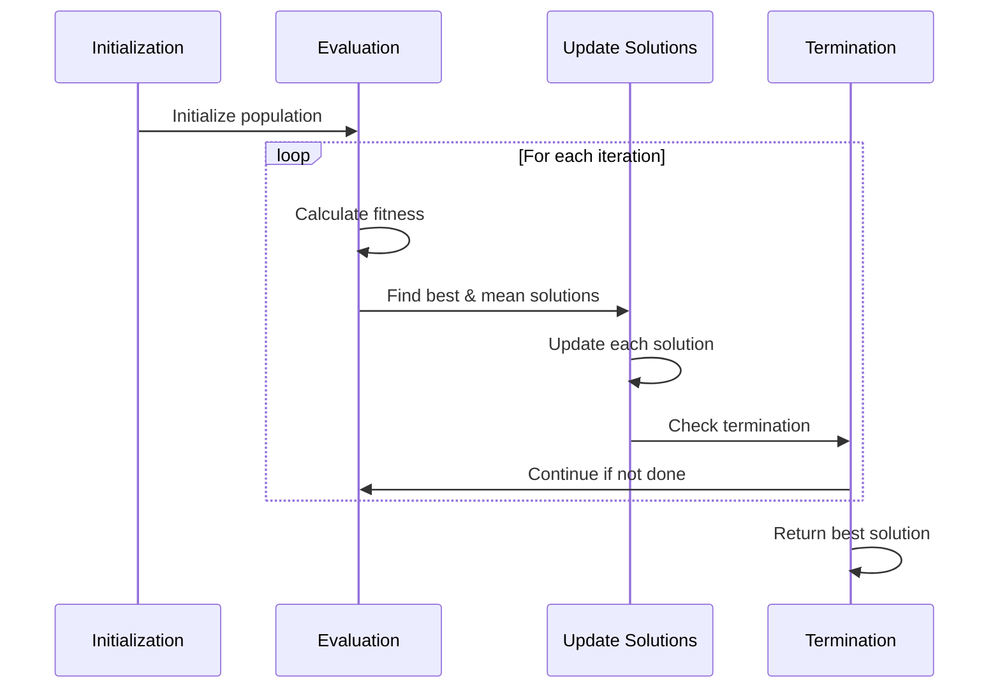
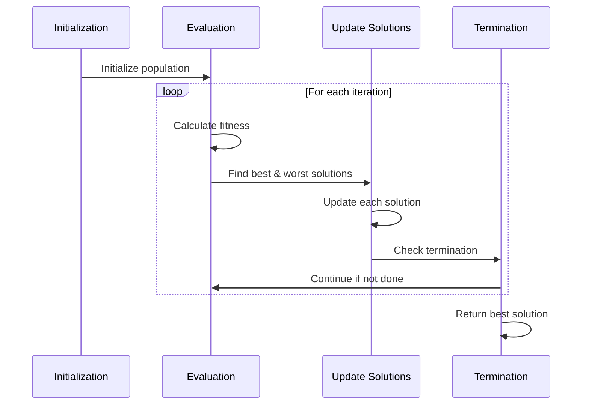
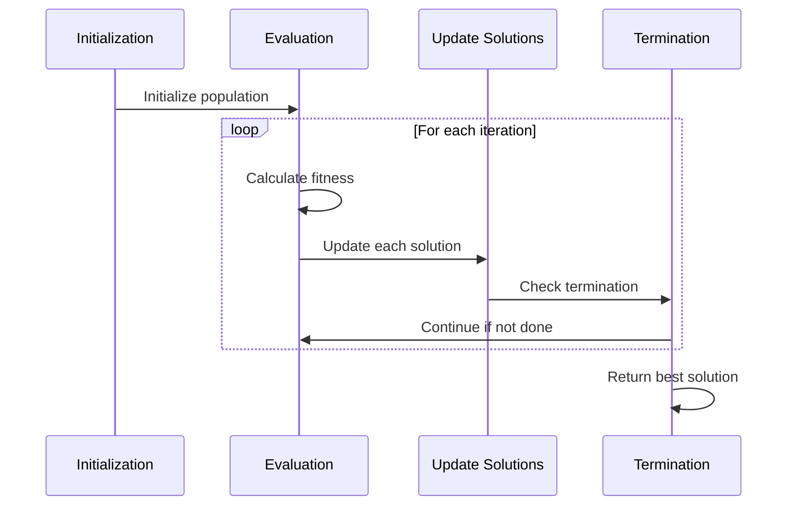
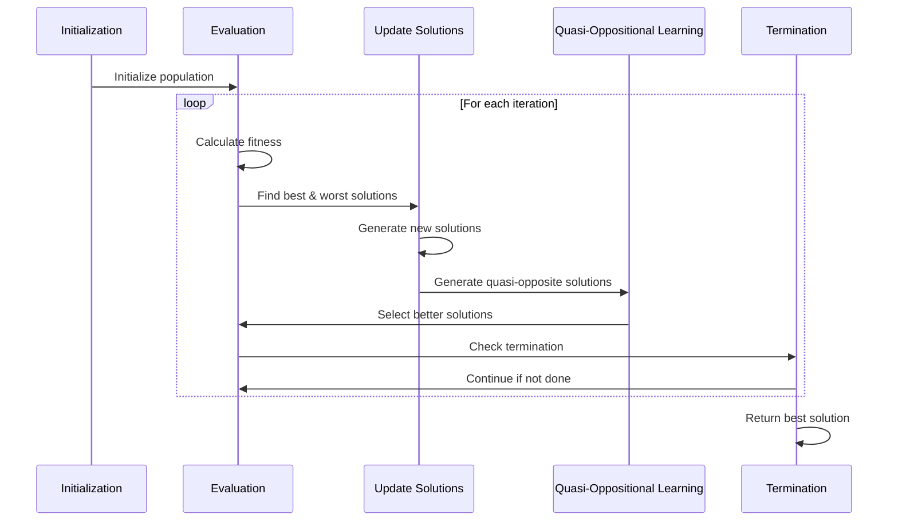
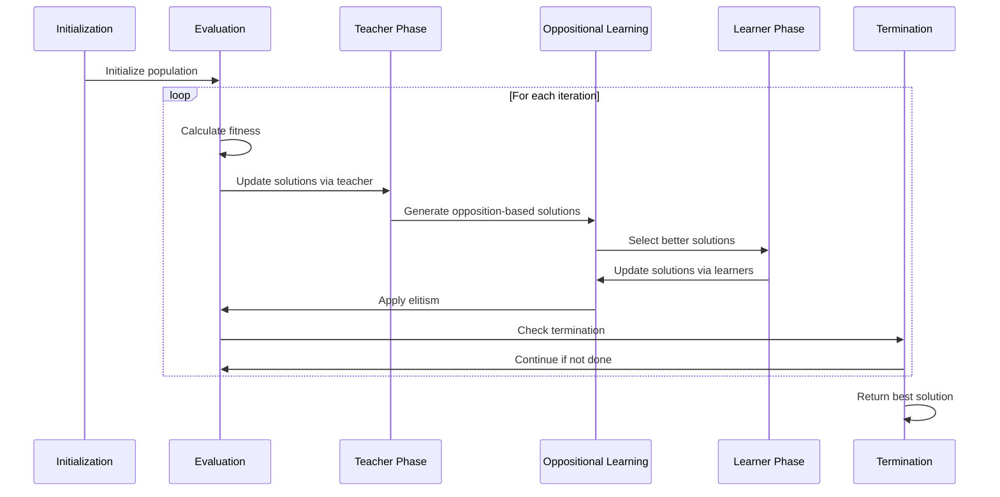
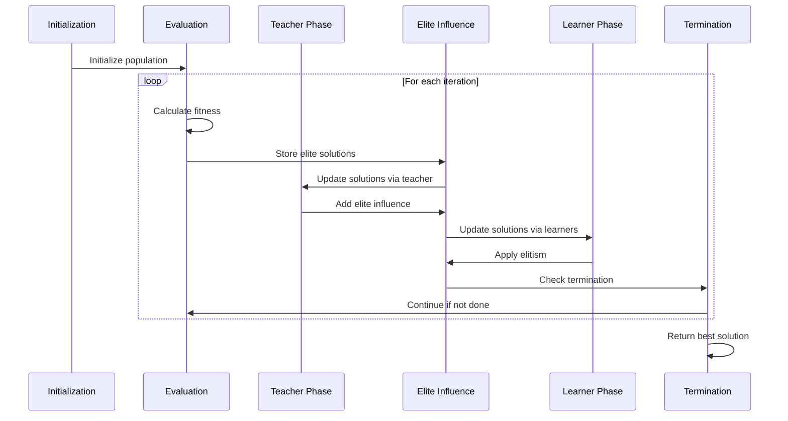
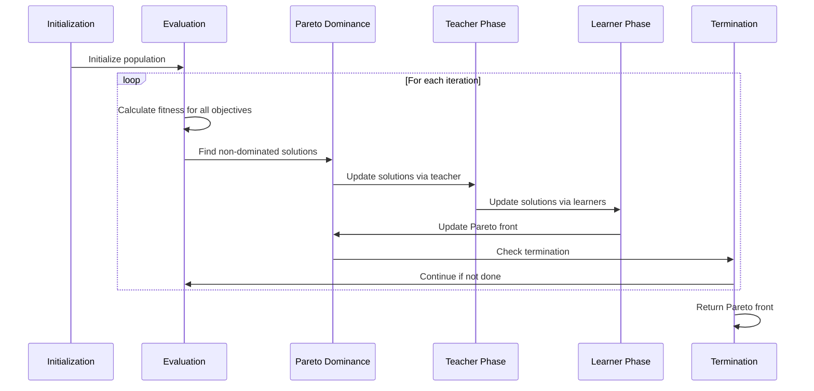

# Algorithms Module

The `algorithms.py` module contains the core optimization algorithms implemented in this package.

## BMR Algorithm

```python
BMR_algorithm(bounds, num_iterations, population_size, num_variables, objective_func, constraints=None)
```

Implements the Best-Mean-Random (BMR) optimization algorithm.

### Parameters

| Parameter | Type | Description |
|-----------|------|-------------|
| `bounds` | numpy.ndarray | Lower and upper bounds for each variable, shape (num_variables, 2) |
| `num_iterations` | int | Maximum number of iterations |
| `population_size` | int | Number of solutions in the population |
| `num_variables` | int | Dimensionality of the problem |
| `objective_func` | callable | Function to be optimized |
| `constraints` | list, optional | List of constraint functions (default: None) |

### Returns

| Return Value | Type | Description |
|--------------|------|-------------|
| `best_solution` | numpy.ndarray | Best solution found |
| `best_scores` | list | List of best scores in each iteration |

### Algorithm Flow



### Example

```python
import numpy as np
from rao_algorithms import BMR_algorithm, objective_function

bounds = np.array([[-100, 100]] * 2)
num_iterations = 100
population_size = 50
num_variables = 2

best_solution, best_scores = BMR_algorithm(
    bounds, 
    num_iterations, 
    population_size, 
    num_variables, 
    objective_function
)
```

## BWR Algorithm

```python
BWR_algorithm(bounds, num_iterations, population_size, num_variables, objective_func, constraints=None)
```

Implements the Best-Worst-Random (BWR) optimization algorithm.

### Parameters

| Parameter | Type | Description |
|-----------|------|-------------|
| `bounds` | numpy.ndarray | Lower and upper bounds for each variable, shape (num_variables, 2) |
| `num_iterations` | int | Maximum number of iterations |
| `population_size` | int | Number of solutions in the population |
| `num_variables` | int | Dimensionality of the problem |
| `objective_func` | callable | Function to be optimized |
| `constraints` | list, optional | List of constraint functions (default: None) |

### Returns

| Return Value | Type | Description |
|--------------|------|-------------|
| `best_solution` | numpy.ndarray | Best solution found |
| `best_scores` | list | List of best scores in each iteration |

### Algorithm Flow



### Example

```python
import numpy as np
from rao_algorithms import BWR_algorithm, objective_function

bounds = np.array([[-100, 100]] * 2)
num_iterations = 100
population_size = 50
num_variables = 2

best_solution, best_scores = BWR_algorithm(
    bounds, 
    num_iterations, 
    population_size, 
    num_variables, 
    objective_function
)
```

## Jaya Algorithm

```python
Jaya_algorithm(bounds, num_iterations, population_size, num_variables, objective_func, constraints=None)
```

Implements the Jaya optimization algorithm.

### Parameters

| Parameter | Type | Description |
|-----------|------|-------------|
| `bounds` | numpy.ndarray | Lower and upper bounds for each variable, shape (num_variables, 2) |
| `num_iterations` | int | Maximum number of iterations |
| `population_size` | int | Number of solutions in the population |
| `num_variables` | int | Dimensionality of the problem |
| `objective_func` | callable | Function to be optimized |
| `constraints` | list, optional | List of constraint functions (default: None) |

### Returns

| Return Value | Type | Description |
|--------------|------|-------------|
| `best_solution` | numpy.ndarray | Best solution found |
| `best_scores` | list | List of best scores in each iteration |

### Algorithm Flow



### Example

```python
import numpy as np
from rao_algorithms import Jaya_algorithm, objective_function

bounds = np.array([[-100, 100]] * 2)
num_iterations = 100
population_size = 50
num_variables = 2

best_solution, best_scores = Jaya_algorithm(
    bounds, 
    num_iterations, 
    population_size, 
    num_variables, 
    objective_function
)
```

## Rao-1 Algorithm

```python
Rao1_algorithm(bounds, num_iterations, population_size, num_variables, objective_func, constraints=None)
```

Implements the Rao-1 optimization algorithm.

### Parameters

| Parameter | Type | Description |
|-----------|------|-------------|
| `bounds` | numpy.ndarray | Lower and upper bounds for each variable, shape (num_variables, 2) |
| `num_iterations` | int | Maximum number of iterations |
| `population_size` | int | Number of solutions in the population |
| `num_variables` | int | Dimensionality of the problem |
| `objective_func` | callable | Function to be optimized |
| `constraints` | list, optional | List of constraint functions (default: None) |

### Returns

| Return Value | Type | Description |
|--------------|------|-------------|
| `best_solution` | numpy.ndarray | Best solution found |
| `best_scores` | list | List of best scores in each iteration |

### Algorithm Flow


### Example

```python
import numpy as np
from rao_algorithms import Rao1_algorithm, objective_function

bounds = np.array([[-100, 100]] * 2)
num_iterations = 100
population_size = 50
num_variables = 2

best_solution, best_scores = Rao1_algorithm(
    bounds, 
    num_iterations, 
    population_size, 
    num_variables, 
    objective_function
)
```

## Rao-2 Algorithm

```python
Rao2_algorithm(bounds, num_iterations, population_size, num_variables, objective_func, constraints=None)
```

Implements the Rao-2 optimization algorithm.

### Parameters

| Parameter | Type | Description |
|-----------|------|-------------|
| `bounds` | numpy.ndarray | Lower and upper bounds for each variable, shape (num_variables, 2) |
| `num_iterations` | int | Maximum number of iterations |
| `population_size` | int | Number of solutions in the population |
| `num_variables` | int | Dimensionality of the problem |
| `objective_func` | callable | Function to be optimized |
| `constraints` | list, optional | List of constraint functions (default: None) |

### Returns

| Return Value | Type | Description |
|--------------|------|-------------|
| `best_solution` | numpy.ndarray | Best solution found |
| `best_scores` | list | List of best scores in each iteration |

### Algorithm Flow


### Example

```python
import numpy as np
from rao_algorithms import Rao2_algorithm, objective_function

bounds = np.array([[-100, 100]] * 2)
num_iterations = 100
population_size = 50
num_variables = 2

best_solution, best_scores = Rao2_algorithm(
    bounds, 
    num_iterations, 
    population_size, 
    num_variables, 
    objective_function
)
```

## Rao-3 Algorithm

```python
Rao3_algorithm(bounds, num_iterations, population_size, num_variables, objective_func, constraints=None)
```

Implements the Rao-3 optimization algorithm.

### Parameters

| Parameter | Type | Description |
|-----------|------|-------------|
| `bounds` | numpy.ndarray | Lower and upper bounds for each variable, shape (num_variables, 2) |
| `num_iterations` | int | Maximum number of iterations |
| `population_size` | int | Number of solutions in the population |
| `num_variables` | int | Dimensionality of the problem |
| `objective_func` | callable | Function to be optimized |
| `constraints` | list, optional | List of constraint functions (default: None) |

### Returns

| Return Value | Type | Description |
|--------------|------|-------------|
| `best_solution` | numpy.ndarray | Best solution found |
| `best_scores` | list | List of best scores in each iteration |

### Algorithm Flow


### Example

```python
import numpy as np
from rao_algorithms import Rao3_algorithm, objective_function

bounds = np.array([[-100, 100]] * 2)
num_iterations = 100
population_size = 50
num_variables = 2

best_solution, best_scores = Rao3_algorithm(
    bounds, 
    num_iterations, 
    population_size, 
    num_variables, 
    objective_function
)
```

## TLBO Algorithm

```python
TLBO_algorithm(bounds, num_iterations, population_size, num_variables, objective_func, constraints=None)
```

Implements the Teaching-Learning-Based Optimization (TLBO) algorithm.

### Parameters

| Parameter | Type | Description |
|-----------|------|-------------|
| `bounds` | numpy.ndarray | Lower and upper bounds for each variable, shape (num_variables, 2) |
| `num_iterations` | int | Maximum number of iterations |
| `population_size` | int | Number of solutions in the population |
| `num_variables` | int | Dimensionality of the problem |
| `objective_func` | callable | Function to be optimized |
| `constraints` | list, optional | List of constraint functions (default: None) |

### Returns

| Return Value | Type | Description |
|--------------|------|-------------|
| `best_solution` | numpy.ndarray | Best solution found |
| `best_scores` | list | List of best scores in each iteration |

### Algorithm Flow


### Example

```python
import numpy as np
from rao_algorithms import TLBO_algorithm, objective_function

bounds = np.array([[-100, 100]] * 2)
num_iterations = 100
population_size = 50
num_variables = 2

best_solution, best_scores = TLBO_algorithm(
    bounds, 
    num_iterations, 
    population_size, 
    num_variables, 
    objective_function
)
```

## QOJAYA Algorithm

```python
QOJAYA_algorithm(bounds, num_iterations, population_size, num_variables, objective_func, constraints=None)
```

Implements the Quasi-Oppositional Jaya (QOJAYA) optimization algorithm, which enhances the standard Jaya algorithm by incorporating quasi-oppositional learning to improve convergence speed and solution quality.

### Parameters

| Parameter | Type | Description |
|-----------|------|-------------|
| `bounds` | numpy.ndarray | Lower and upper bounds for each variable, shape (num_variables, 2) |
| `num_iterations` | int | Maximum number of iterations |
| `population_size` | int | Number of solutions in the population |
| `num_variables` | int | Dimensionality of the problem |
| `objective_func` | callable | Function to be optimized |
| `constraints` | list, optional | List of constraint functions (default: None) |

### Returns

| Return Value | Type | Description |
|--------------|------|-------------|
| `best_solution` | numpy.ndarray | Best solution found |
| `best_scores` | list | List of best scores in each iteration |

### Algorithm Flow



### Example

```python
import numpy as np
from rao_algorithms import QOJAYA_algorithm, objective_function

bounds = np.array([[-100, 100]] * 2)
num_iterations = 100
population_size = 50
num_variables = 2

best_solution, best_scores = QOJAYA_algorithm(
    bounds, 
    num_iterations, 
    population_size, 
    num_variables, 
    objective_function
)
```

### Real-world Application

QOJAYA has been successfully applied to optimize welding processes, including tungsten inert gas (TIG) welding and friction stir welding. It determines optimal parameters like welding current, voltage, and speed to maximize weld strength while minimizing defects.

**Reference**: R. V. Rao, D. P. Rai, "Optimization of welding processes using quasi-oppositional-based Jaya algorithm", Journal of Mechanical Science and Technology, 31(5), 2017, 2513-2522.

## GOTLBO Algorithm

```python
GOTLBO_algorithm(bounds, num_iterations, population_size, num_variables, objective_func, constraints=None)
```

Implements the Generalized Oppositional Teaching-Learning-Based Optimization (GOTLBO) algorithm, which enhances the standard TLBO algorithm by incorporating oppositional-based learning to improve convergence speed and solution quality.

### Parameters

| Parameter | Type | Description |
|-----------|------|-------------|
| `bounds` | numpy.ndarray | Lower and upper bounds for each variable, shape (num_variables, 2) |
| `num_iterations` | int | Maximum number of iterations |
| `population_size` | int | Number of solutions in the population |
| `num_variables` | int | Dimensionality of the problem |
| `objective_func` | callable | Function to be optimized |
| `constraints` | list, optional | List of constraint functions (default: None) |

### Returns

| Return Value | Type | Description |
|--------------|------|-------------|
| `best_solution` | numpy.ndarray | Best solution found |
| `best_scores` | list | List of best scores in each iteration |

### Algorithm Flow



### Example

```python
import numpy as np
from rao_algorithms import GOTLBO_algorithm, objective_function

bounds = np.array([[-100, 100]] * 2)
num_iterations = 100
population_size = 50
num_variables = 2

best_solution, best_scores = GOTLBO_algorithm(
    bounds, 
    num_iterations, 
    population_size, 
    num_variables, 
    objective_function
)
```

### Real-world Application

GOTLBO has been applied to mechanical design optimization problems, including the design of pressure vessels, spring design, and gear train design. It effectively finds optimal dimensions and parameters that minimize weight while satisfying safety constraints.

**Reference**: R. V. Rao, V. Patel, "An improved teaching-learning-based optimization algorithm for solving unconstrained optimization problems", Scientia Iranica, 20(3), 2013, 710-720.

## ITLBO Algorithm

```python
ITLBO_algorithm(bounds, num_iterations, population_size, num_variables, objective_func, constraints=None)
```

Implements the Improved Teaching-Learning-Based Optimization (ITLBO) algorithm, which enhances the standard TLBO algorithm with an adaptive teaching factor, elite solution influence, and three-way interaction in the learner phase.

### Parameters

| Parameter | Type | Description |
|-----------|------|-------------|
| `bounds` | numpy.ndarray | Lower and upper bounds for each variable, shape (num_variables, 2) |
| `num_iterations` | int | Maximum number of iterations |
| `population_size` | int | Number of solutions in the population |
| `num_variables` | int | Dimensionality of the problem |
| `objective_func` | callable | Function to be optimized |
| `constraints` | list, optional | List of constraint functions (default: None) |

### Returns

| Return Value | Type | Description |
|--------------|------|-------------|
| `best_solution` | numpy.ndarray | Best solution found |
| `best_scores` | list | List of best scores in each iteration |

### Algorithm Flow



### Example

```python
import numpy as np
from rao_algorithms import ITLBO_algorithm, objective_function

bounds = np.array([[-100, 100]] * 2)
num_iterations = 100
population_size = 50
num_variables = 2

best_solution, best_scores = ITLBO_algorithm(
    bounds, 
    num_iterations, 
    population_size, 
    num_variables, 
    objective_function
)
```

### Real-world Application

ITLBO has been successfully applied to optimize heat exchangers, finding the optimal design parameters that maximize heat transfer while minimizing pressure drop and material costs. It has also been used for power system optimization to minimize generation costs and transmission losses.

**Reference**: R. V. Rao, V. D. Kalyankar, "Multi-objective TLBO algorithm for optimization of modern machining processes", Advances in Intelligent Systems and Computing, 236, 2014, 21-31.

## Multi-objective TLBO Algorithm

```python
MultiObjective_TLBO_algorithm(bounds, num_iterations, population_size, num_variables, objective_funcs, constraints=None)
```

Implements the Multi-objective Teaching-Learning-Based Optimization (MO-TLBO) algorithm, which extends TLBO to handle multiple competing objectives using Pareto dominance and crowding distance for selection.

### Parameters

| Parameter | Type | Description |
|-----------|------|-------------|
| `bounds` | numpy.ndarray | Lower and upper bounds for each variable, shape (num_variables, 2) |
| `num_iterations` | int | Maximum number of iterations |
| `population_size` | int | Number of solutions in the population |
| `num_variables` | int | Dimensionality of the problem |
| `objective_funcs` | list | List of objective functions to be optimized |
| `constraints` | list, optional | List of constraint functions (default: None) |

### Returns

| Return Value | Type | Description |
|--------------|------|-------------|
| `pareto_front` | numpy.ndarray | Set of non-dominated solutions (Pareto front) |
| `pareto_fitness` | numpy.ndarray | Fitness values of the Pareto front solutions |
| `best_scores_history` | list | History of best scores for each objective |

### Algorithm Flow



### Example

```python
import numpy as np
from rao_algorithms import MultiObjective_TLBO_algorithm

# Define two objective functions
def objective_function1(x):
    return np.sum(x**2)  # Minimize the sum of squares

def objective_function2(x):
    return np.sum((x-2)**2)  # Minimize the sum of squares from point (2,2,...)

bounds = np.array([[-100, 100]] * 2)
num_iterations = 100
population_size = 50
num_variables = 2

pareto_front, pareto_fitness, best_scores_history = MultiObjective_TLBO_algorithm(
    bounds, 
    num_iterations, 
    population_size, 
    num_variables, 
    [objective_function1, objective_function2]
)
```

### Real-world Application

The Multi-objective TLBO algorithm has been applied to optimize machining processes like turning, milling, and grinding operations. It simultaneously optimizes multiple objectives such as surface roughness, material removal rate, and tool wear, helping manufacturers achieve high-quality parts with efficient production.

**Reference**: R. V. Rao, V. D. Kalyankar, "Multi-objective TLBO algorithm for optimization of modern machining processes", Advances in Intelligent Systems and Computing, 236, 2014, 21-31.

## Implementation Details

Both algorithms follow a similar structure:

1. Initialize population randomly within bounds
2. For each iteration:
   - Evaluate fitness (with penalty for constraints if applicable)
   - Identify key solutions (best/mean for BMR, best/worst for BWR)
   - Update each solution based on algorithm-specific rules
   - Clip solutions to stay within bounds
3. Return the best solution and convergence history

The main difference between the algorithms is in the update rule:

- **BMR**: Uses best solution, mean solution, and random solution
- **BWR**: Uses best solution, worst solution, and random solution
