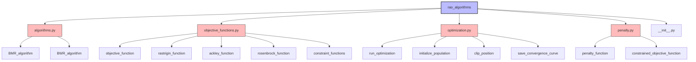

# API Reference

This section provides detailed documentation for the API of the optimization algorithms package.

## Modules

1. [Algorithms](algorithms.md) - Core optimization algorithms (BMR and BWR)
2. [Objective Functions](objective_functions.md) - Predefined objective functions and constraints
3. [Optimization](optimization.md) - Utilities for running optimization
4. [Penalty](penalty.md) - Constraint handling through penalty functions

## Module Structure



## Key Functions

| Function | Module | Description |
|----------|--------|-------------|
| `BMR_algorithm` | algorithms.py | Implements the BMR (Best-Mean-Random) algorithm |
| `BWR_algorithm` | algorithms.py | Implements the BWR (Best-Worst-Random) algorithm |
| `run_optimization` | optimization.py | High-level function to run optimization algorithms |
| `constrained_objective_function` | penalty.py | Combines objective function with penalty for constraints |
| `objective_function` | objective_functions.py | Sphere function (default objective function) |

## Importing the Package

```python
# Import the entire package
import rao_algorithms

# Import specific algorithms
from rao_algorithms import BMR_algorithm, BWR_algorithm

# Import utility functions
from rao_algorithms import run_optimization

# Import objective functions and constraints
from rao_algorithms import objective_function, rastrigin_function, constraint_1, constraint_2
```

For detailed documentation of each module, please refer to the links above.
