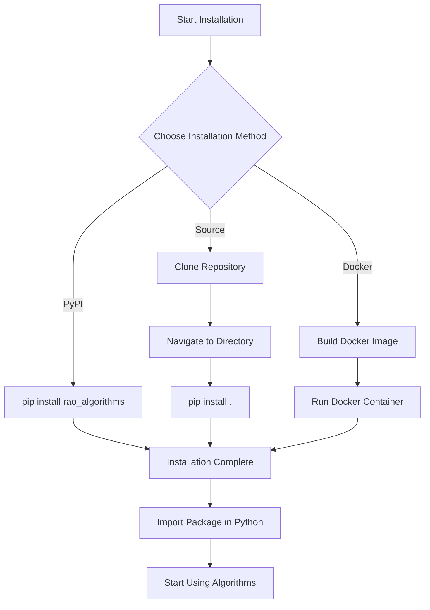

# Installation Guide

This guide provides instructions for installing the BMR and BWR optimization algorithms package.

## Prerequisites

Before installing the package, ensure you have the following prerequisites:

- Python 3.7 or higher
- pip (Python package installer)
- NumPy

## Installation Methods

### Method 1: Install from PyPI

The simplest way to install the package is directly from PyPI:

```bash
pip install rao_algorithms
```

### Method 2: Install from Source

Alternatively, you can clone the repository and install it locally:

```bash
# Clone the repository
git clone https://github.com/VaidhyaMegha/optimization_algorithms.git

# Navigate to the project directory
cd optimization_algorithms

# Install the package
pip install .
```

### Method 3: Using Docker

If you prefer using Docker, you can build and run the package in a Docker container:

```bash
# Build the Docker image
docker build -t optimization-algorithms .

# Run the Docker container
docker run -it optimization-algorithms
```

## Installation Flowchart



## Verification

To verify that the installation was successful, you can run a simple test:

```python
import rao_algorithms

# Print the version
print(rao_algorithms.__version__)
```

## Dependencies

The package has the following dependencies:

- NumPy: For numerical computations
- Matplotlib (optional): For visualizing results

## Troubleshooting

If you encounter any issues during installation:

1. Ensure you have the latest version of pip:
   ```bash
   pip install --upgrade pip
   ```

2. Check that you have the required dependencies:
   ```bash
   pip install numpy
   ```

3. If you're installing from source, make sure you're in the correct directory with the setup.py file.

For further assistance, please open an issue on the [GitHub repository](https://github.com/VaidhyaMegha/optimization_algorithms).
