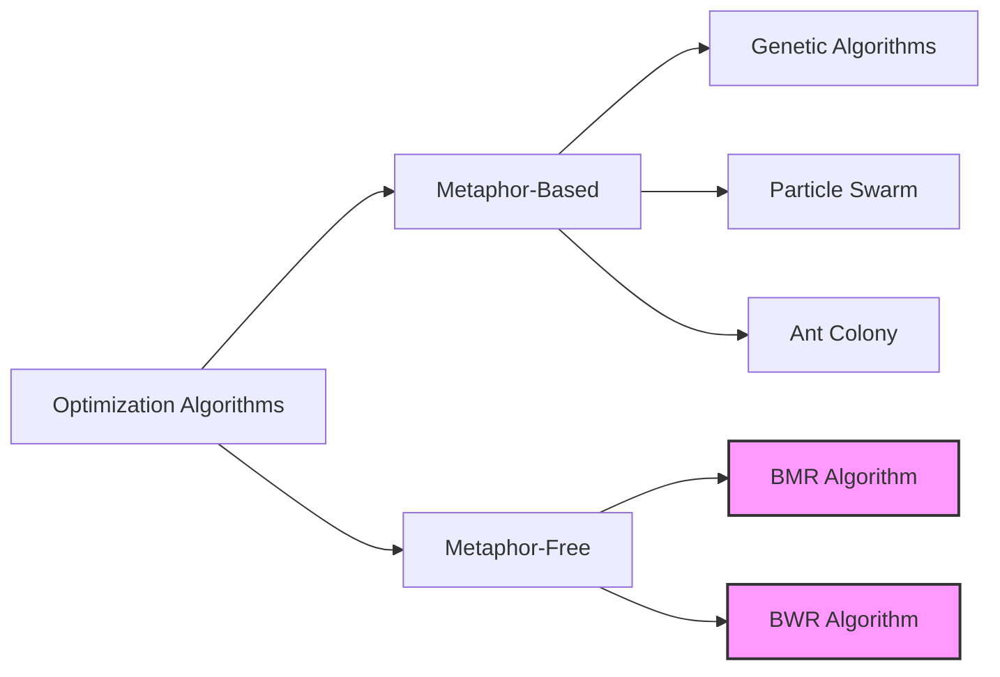

# Introduction to BMR and BWR Optimization Algorithms

## Overview

The BMR and BWR optimization algorithms are simple yet powerful optimization techniques designed to solve both constrained and unconstrained optimization problems. Unlike many popular optimization algorithms that rely on nature-inspired metaphors, these algorithms are metaphor-free and require minimal parameter tuning.

## Key Features

- **Metaphor-Free**: No reliance on nature-inspired metaphors or complex analogies
- **Simple**: Minimal algorithm-specific parameters to tune
- **Versatile**: Handles both constrained and unconstrained optimization problems
- **Efficient**: Competitive performance with established optimization algorithms
- **Easy to Implement**: Simple algorithm structure makes implementation straightforward

## Algorithm Comparison

## Academic Background

The BMR and BWR algorithms are based on the paper:

**Ravipudi Venkata Rao and Ravikumar Shah (2024)**, "BMR and BWR: Two simple metaphor-free optimization algorithms for solving real-life non-convex constrained and unconstrained problems." [arXiv:2407.11149v2](https://arxiv.org/abs/2407.11149).

## When to Use BMR and BWR

These algorithms are particularly useful when:

1. You need a simple, easy-to-implement optimization algorithm
2. You want to avoid complex parameter tuning
3. You're dealing with constrained optimization problems
4. You need an algorithm that balances exploration and exploitation effectively

## Next Steps

- Check the [Installation Guide](installation.md) to get started
- Explore the [Algorithm Documentation](algorithms/index.md) for detailed information
- Try the [Examples](examples/index.md) to see the algorithms in action
